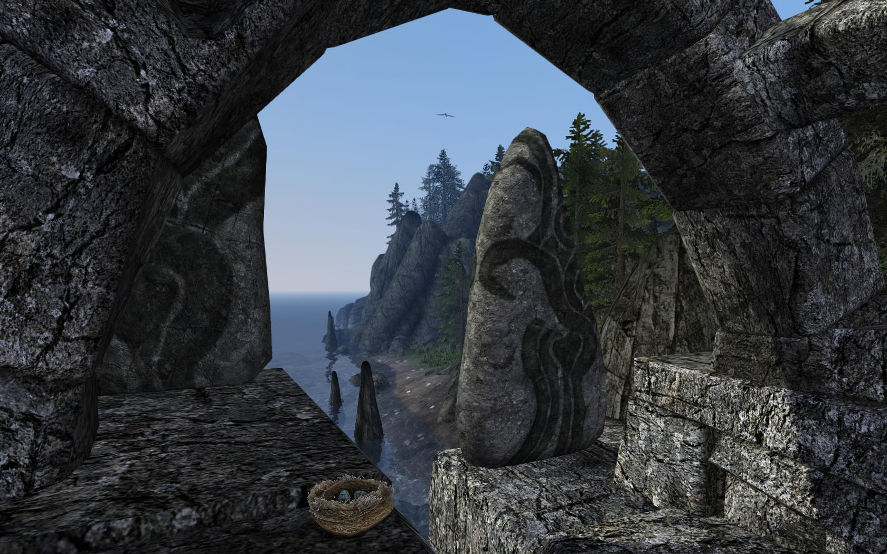
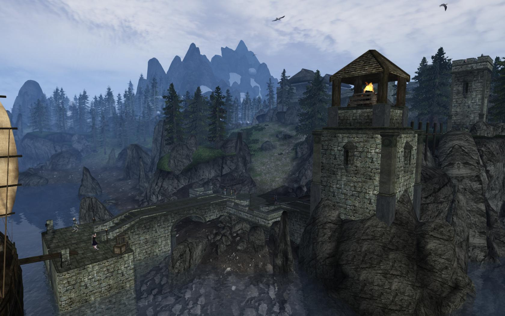
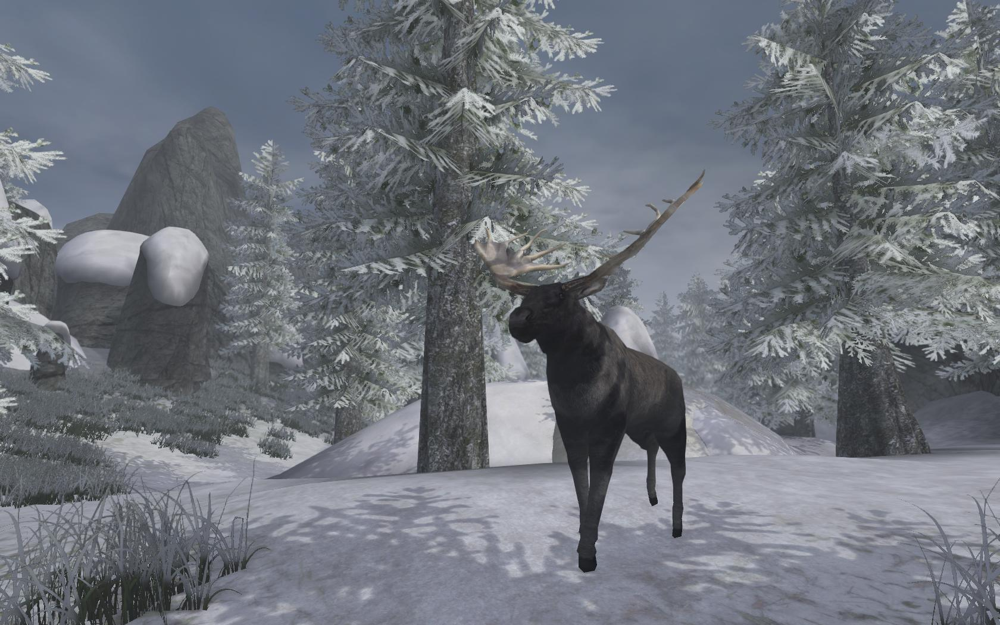

##### By Wollirollo, Atrayonis, Chef, Odika, MinerMan60101, Stripes, Lucevar, Bluttier and Grumple

### Overview
TOTSP goal is to improve the graphical fidelity, environmental design, and gameplay of the Bloodmoon DLC's to a level that is consistent with modern Tes3 mod projects, such as Tamriel Rebuilt and Project Tamriel.

### [Gallery](pending)
Comparision slides:
- [View from Thormoor’s Watch](https://imgsli.com/MTE5MDc/0/2)
- [Fort Frostmoth](https://imgsli.com/MTE5MDg/0/2)
- [Skaal Village](https://imgsli.com/MTE5MDk/0/2)
- [Iggnir River](https://imgsli.com/MTE5MTU/0/2)

### [Changelog](https://ellisnz.github.io/Tomb-of-The-Snow-Prince/CL_ToTSP)

### Download
- [Solstheim Tomb of the Snow Prince v2.2.0](https://github.com/EllisNZ/Tomb-of-The-Snow-Prince/releases/tag/P1-2.2.0)
- [Solstheim Graphical Replacer v2.2.0](https://github.com/EllisNZ/Tomb-of-The-Snow-Prince/releases/tag/P2-2.2.0)

### Installation
TOTSP has one significant requirement, [Tamriel Data](https://www.nexusmods.com/morrowind/mods/44537), which is a data repository used and contributed to by many large mods. I also strongly suggest installing and familiarizing yourself with many of the engine improvements and mods listed [here](https://www.tamriel-rebuilt.org/recommended-mods). TOTSP is best installed after you have first achieved a stable installation baseline. 

For the actual installation of TOTSP, I recommend the use of [Wrye Mash](https://www.nexusmods.com/morrowind/mods/45439):
1. Download and install Wrye Mash, Polemos Fork
2. Create a folder named "Installers" in or beside your Morrowind Folder - NOT in your Data Files folder.
3. Download the Solstheim archive(s) and put them into your “Installer” packages folder
4. Open Wrye Mash and click on the Installers tab
5. Click on the mod archive. On the right, you will see a list of sub-packages. 
6. Select (tick) the sub-packages you want (you always need the core package)
7. Right click the archive package in the primary installers field and select install
8. Go Back to the Mods tab and enable the TOTSP esm and esp files.

### Sub-Packages
TOTSP has been split into two packages. The first “Solstheim_Tomb_of_the_Snow_Prince”, contains the landmass overhaul itself, as well as some optional gameplay mods. The second “Solstheim_Graphical_Replacer” contains only graphical replacers. The two packages are not reliant upon one another. For example, if you want to play TOTSP with vanilla  textures and models then ignore the latter package (as seen in the comparison gallery). 

##### Tomb of the Snow Prince:
- 000 Core: a requirement of all subsequential packages.
- 010 Solstheim - Tomb of the Snow Prince: the landmass overhaul itself. Also includes an esp that adds many new animals and items to - Solstheim level lists, including moose, goats, squirrels, large spiders and various fish.
- 011 TOTSP Patches: an ever-growing archive of significant compatibility patches between TOTSP and other mods.
- 012 Missing Snow Armor Pieces: by Psysama, this mod seamlessly implements Snow Bear and Snow Wolf shields that was otherwise absent in Bloodmoon. It also retextures the vanilla Wolf Shield, as it originally used a texture clearly intended for the Snow Wolf armor set (this texture is now used on the Snow Wolf Shield).
- 013 Fierce Wolf Helmet: by Alaisiagae and Psymoniser, this replaces the cap-like Wolf armor helmets for wolf heads with agape jaws, similar to the standard Bear helmets.
- 014 Hide-Like Animals Pelts: replaces the vanilla animal pelt meshes with hide models, in case you want something less gruesome and more decorative. 

##### Solstheim Graphical Replacer:
- 010 Solstheim - HD Worldspace Graphical Replacer: a comprehensive graphical replacer for the many physical assets found in Solstheim, particularly all ground textures, as well as Skaal and Raven Rock architecture. This package requires [Glow in the Dahrk](https://www.nexusmods.com/morrowind/mods/45886) as some of the replacement window meshes are GiTD-aware. Don’t forget to use the Raven Rock add-on which I also helped develop. I also recommend [Graphical Herbalism](https://www.nexusmods.com/morrowind/mods/46599), as all the included flora replacers (such as holly and wolfsbane) are GH-aware.
- 011 Skyrim-Like Trees: replaces the stock Bloodmoon trees with new models akin to those seen in TESV: Skyrim.
- 012 Remiros’ Groundcover for TOTSP: bespoke groundcover for the overhauled Solstheim. Requires [Remiros’ Groundcover](https://www.nexusmods.com/morrowind/mods/46733), as the art files are not included in TOTSP. Remember to enable the groundcover .esp when generating distant land in MGE XE, but do not enable it in the Morrowind launcher, as the grass will become static and impassable.
- 012 Grey Solstheim Rocks: overwrites the darker rock texture in the main package with the greyer rock textures from Otis_Geo’s Vanilla Land mod.

### Compatibility Patch Compilations
- [RandomPal's compilation](https://www.nexusmods.com/morrowind/mods/48422)
- [Revenorror's compilation](https://www.nexusmods.com/morrowind/mods/48525)

### Credits

##### TOTSP’s Testers
Bluttier, BUBISHI, Chef, Factor, Frumple Grumple, Leyawynn, Lucevar, Remiros, Melchior Dahrk, Abot, WHreaper

##### Solstheim Asset Contributors
The Tamriel Rebuilt and Project Tamriel teams for Tamriel Data, Chainy: Hircine statue, SGMonkey: terrain textures, Nebula1: terrain textures, Otis_Geo: terrain textures, ddy: terrain textures, dawghus: Nord tapestries, Hicks123: various textures, Stupostar: various mesh changes and optimizations, and Graphical Herbalism models, Alaisiagae: Bloodmoon pelt replacer BPR, wolf helmet replacer, Remiros: eagle sword, Raven Rock HD, Lake Fjalding fix, Saint_Juib: Snow Prince armor redux, Morana: better Snow Prince armor, Prince Psystorm: missing snow Armor

### Permissions
Under no circumstances may you redistribute TOTSP. You may create mods that depend upon the TOTSP esms and esps. 
